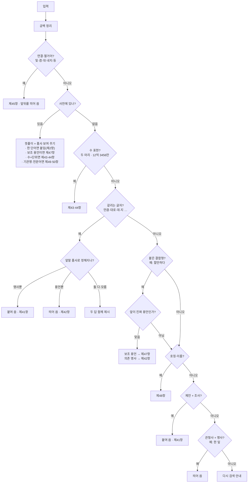

# 한국어 띄어쓰기는 어려워

> 고쳐주지 않고, 한글 맞춤법과 사전으로 **근거를 보여드립니다.**

붙여 쓴 표현을 입력하면, **우리말샘 사전**과 **한글 맞춤법**을 찾아서 *왜 그렇게 띄거나 붙여 쓰는지*를
규정(조항)과 함께 알려 줍니다. 답만 던지는 게 아니라 **"왜 그런지"를 보여 주는 도구**예요.

```
입력:  얼마만큼
결과:  얼마만큼  ← 붙여 씁니다
       '얼마'는 명사라서 뒤의 '만큼'은 조사예요. 조사는 앞말에 붙여 써요. (제41항)
```

쓰는 방법은 두 가지예요 — **사람이 직접 보는 화면**, 그리고 **AI(Claude 등)가 대신 불러서 쓰는 방식**.
(→ [어떻게 쓰나](#어떻게-쓰나))

---

## 왜 만들었나

국립국어원에 들어오는 국어 질문 중 **띄어쓰기가 35.48%로 1위(한 해 15만 건이 넘어요)**입니다.
전문가도 답하려면 매번 사전을 뒤지고, 규정 해설을 읽고, 품사를 따져 봐야 해요.

> "이 번거로운 확인을, 도구가 먼저 정리해서 보여 줄 순 없을까?"

여기서 시작했습니다.

---

## 무엇을 도와주나

규정별로 도구가 어디까지 도와주는지 정리했어요. (이 표가 기능의 **기준**이고, 아래 "한계"는 표가
다 못 담는 부분만 덧붙입니다.)

| 항 | 다루는 내용 | 예시 | 못하는 것 |
|----|------------|------|-----------|
| **제2항** 각 단어는 띄어 씀 | 띄어쓰기의 큰 원칙 | 사전 단어의 뜻·품사 보여 주기 | 문장을 통째로 넣고 자동으로 띄어 주기 |
| **제41항** 조사는 붙여 씀 | 조사 붙이기 | `학교에서처럼`, `얼마만큼` | 사전에 없는 조사, 어미와 헷갈리는 형태 |
| **제42항** 의존 명사는 띄어 씀 | `만큼·대로·뿐·데·지` 등 | `아는 만큼`(동사 뒤) | 뜻으로만 갈리는 `-ㄴ데/-ㄴ지`는 두 답 제시 |
| **제43항** 단위는 띄어 씀 | 수 + 단위 | `두 마리`, `스무 살`, `오백 원`, `차 한 대` | 목록에 없는 단위 |
| **제44항** 큰 수는 만 단위로 | 만·억·조 띄어쓰기 | `12억 3456만`, `삼천이백억 오천만 원` | 만 단위가 없는 순수 숫자(`1234567`) |
| **제45항** 연결·열거어는 띄어 씀 | `및·겸·대·내지·등` | `한국어 및 한국문화`, `청군 대 백군` | 연결어 띄어쓰기만 확인(각 단어 내부는 따로) |
| **제47항** 보조 용언 | 본용언 + 보조 용언 | `할 만하다`, `도와 주다` | 목록 밖 보조 용언 |
| **제48항** 이름·호칭 | 성명 + 호칭 | 이름 뒤 직함 | 복잡한 성명, 외국 이름 |
| **제49·50항** 고유명사·전문어 | 기관명·전문 용어 | `인공지능위원회`, `정상나선은하`→`정상 나선 은하` | 사전에 없는 신조어 |

---

## 어떻게 판단하나

입력을 받으면 아래 순서로 하나씩 확인하면서, **가장 잘 맞는 답**을 보여 줍니다. 먼저 사전을 찾아보고
(있으면 바로 뜻과 규정을 보여 줌), 없으면 규칙들을 **차례차례** 거쳐서 처음 들어맞는 데서 멈춰요.
어디에도 확신이 없으면 억지로 답하지 않고 "다시 검색해 보세요"라고 안내합니다.



**"어떻게 찾았는지"도 함께 보여 줘요.** 판정이 끝나면 어떤 순서로 확인해서 그 답에 닿았는지를 한 줄씩
같이 보여 줍니다. 결론만이 아니라 *과정*까지 보이게 한 거예요.

---

## 어떻게 쓰나

### 1) 화면으로 직접 보기

창을 띄워서 검색하듯 씁니다.

```bash
pip install -r requirements.txt
python -m shell.webui.app
```

검색창에 궁금한 표현을 **붙여 써서** 넣으면, 사전 정보·적용 규정(원문과 해설)·띄어쓰기 표기·찾은
순서를 보여 줍니다.

### 2) AI가 대신 불러 쓰기 (MCP)

이 도구를 **AI가 외부 도구를 끌어다 쓰게 해 주는 표준 연결 방식(MCP, Model Context Protocol)** 으로
띄우면, **Claude 같은 AI가 대화하다가 직접 이 도구를 불러서** 답할 수 있어요. AI에게 "띄어쓰기 어때?"라고 물으면, AI가 짐작으로 답하는 대신 **이 도구를 불러 사전 근거로**
대답합니다. (비유하면, AI에게 "띄어쓰기 전문 사전"을 손에 쥐여 주는 셈이에요.)

AI가 쓸 수 있는 기능 세 가지:

| 기능 | 하는 일 |
|------|---------|
| `inspect_spacing` | 붙여 쓴 표현의 띄어쓰기를 근거와 함께 판정 |
| `search_dictionary` | 우리말샘에서 단어 찾기(품사·뜻풀이) |
| `get_rule` | 특정 규정(`제42항` 등)의 원문·예시·해설 보기 |

**연결하는 법** — Claude Code(또는 Claude 데스크톱 앱) 설정에 아래 한 덩어리를 넣고 다시 시작하면
도구가 잡힙니다. (경로는 본인 환경에 맞게 바꿔 주세요.)

```json
{
  "mcpServers": {
    "korean-spacing": {
      "command": "python",
      "args": ["-m", "shell.mcp.server"],
      "env": {
        "PYTHONPATH": "/경로/korean-spacing",
        "KOREAN_SPACING_DB_PATH": "/경로/korean-spacing/dict.db"
      }
    }
  }
}
```

연결한 다음에는 그냥 대화로 "정상나선은하 띄어쓰기 확인해줘" 하면 AI가 알아서 불러 줍니다.

> 지금은 **내 컴퓨터 안에서 도는 방식**이라, 같은 컴퓨터의 Claude Code·데스크톱 앱에서 됩니다.
> 웹 브라우저의 Claude나 다른 서비스에 붙이려면 **인터넷 주소(URL)** 가 필요한데, 그건 다음 과제예요.

---

## 한계 (솔직하게)

이 도구는 **자동 교정기가 아니에요.** 확신이 없으면 틀린 답을 내놓느니 **두 가지를 다 보여 주거나,
아예 말을 아낍니다.** 표가 다 못 담는 경우는 이래요.

- **앞말이 명사도 되고 용언도 되는 경우** — 예: `본대로`의 '본'은 명사 '본'일 수도, '보다'의 활용형일
  수도 있어 하나로 못 정해요. 그래서 두 답을 같이 보여 줍니다.
- **뜻으로만 갈리는 어미** — `-ㄴ데/-ㄴ지`는 둘 다 동사 뒤에 붙어서, 형태만으론 구별이 안 돼요.
  두 해석과 구별 기준을 안내합니다.
- **불규칙 활용** — 자주 쓰는 불규칙은 거의 처리하지만, 형태가 다른 단어와 겹쳐 헷갈릴 위험이 있는
  일부는 정확도를 위해 일부러 빼 두었어요.
- **사전에 없는 합성어** — 새 단어가 한 단어로 인정되는지는 사전 등재 여부를 따릅니다.
- **여러 어절·문장** — 단어나 짧은 표현 하나에 맞춰져 있어요. 문장 전체 분석은 다음 과제라, 되도록
  단어·짧은 표현으로 넣어 주세요.
- **틀린 게 없으면 조용할 때도 있어요** — 이미 바르게 쓴 경우엔 바꿀 게 없죠. `삼천이백억`처럼 도구가
  "맞다"고 확인할 수 있는 건 "이미 바르게 적혔어요"라고 알려 주지만, 미처 다루지 못하는 형태는 그냥
  "다시 검색" 안내로 넘어가기도 합니다(그대로 쓰면 맞는 경우예요).

---

## 왜 이렇게 만들었나

이 도구는 **단어를 잘게 쪼개 분석해 주는 별도 프로그램(형태소 분석기, 예: KoNLPy·mecab)을 쓰지
않아요.** 대신 ① 우리말샘 사전, ② 한글 글자를 자음·모음으로 쪼개 계산하는 방식(자모 계산), ③ 손으로
고른 작은 단어 목록(조사·단위·보조 용언 등), 이 세 가지로만 판단합니다. 일부러 그렇게 골랐고, 위의
한계들은 대부분 이 선택과 맞바꾼 거예요.

1. **분석기 대신 사전 + 규칙 — 가볍고, 흔들리지 않고, 설명할 수 있어서.**
   이건 *교정기*가 아니라 *근거를 보여 주는* 도구예요. 통계나 학습으로 답하는 모델은 같은 입력에도
   답이 흔들리고 "왜 그렇게 봤는지" 설명이 어렵습니다. 사전 + 규칙은 **늘 같은 답**을 주고, 그
   근거(품사·조항)를 그대로 펼쳐 보일 수 있어요.

2. **끝에서부터 떼어 본다 — 한국어는 끝에 답이 있으니까.**
   띄어쓰기를 가르는 말(조사·어미·의존 명사·단위)은 거의 다 어절 **끝**에 붙어요. 그래서 "끝에서 가장
   긴 조각을 떼고, 남은 앞부분을 확인"하는 단순한 방법으로 대부분 풀립니다.

3. **앞부분이 진짜 용언인지 확인한다 — 잘못 쪼개지 않으려고.**
   `주먹만하다`를 `주먹 만하다`로 쪼개면 안 되겠죠. 그래서 떼어낸 앞부분을 거꾸로 풀어 기본형을
   만들어 보고(`할`→`하다`), 사전에 동사·형용사로 있는지 확인되면 그때만 쪼갭니다.

4. **단어 목록을 일부러 좁게 닫아 뒀다 — 정확도를 위해.**
   사전에서 헷갈리는 단어를 다 끌어오면 엉뚱한 데서 오작동해요. 그래서 자주 쓰는 것만 골라 담았습니다.
   목록 밖은 놓치는 대신, 잘못 답하는 일이 적어요.

5. **확신이 없으면 단정하지 않는다 — 틀린 답이 제일 나쁘니까.**
   이 도구를 관통하는 원칙이에요. 앞말 품사로 답이 정해지면 하나로 좁히고, 못 가리면 두 해석을 나란히
   보여 줍니다. 그래서 "뜻으로만 갈리는 어미"에 두 답이 나오는 건 **고장이 아니라 정답**이에요.
   한마디로, **많이 잡기보다 틀리지 않기를 택한** 도구입니다.

---

## AI와 함께 만든 이야기

이 도구는 국어학 전공자가 방향을 잡고, AI 코딩 도구(**Claude Code, opencode**)와 함께 만들었습니다.
"전문가가 띄어쓰기를 확인할 때 거치는 과정을 그대로 도구로 옮기자"는 목표 아래 역할을 이렇게 나눴어요.

- **언어학 판단은 사람이** — 어떤 조항을 어떻게 적용할지, 같은 글자를 무엇으로 구별할지는 사람이
  최종 책임을 졌습니다. 우리말샘 사전과 한글 맞춤법 해설이 근거예요.
- **규칙 설계는 함께** — "체언 뒤면 조사, 용언 뒤면 의존 명사"처럼 말로 된 규칙을 코드로 옮기면서
  AI와 의논해 경계를 다듬었습니다.
- **코드·테스트·문서는 AI가 많이** — 계산 로직, 사전 조회, 검출기, 테스트, 이 README까지 AI가 초안을
  만들고 사람이 검수·수정했습니다.

다만 AI는 빠르게 만들어 주지만 **무엇이 국어학적으로 맞는지는 스스로 판단하지 못해요.** 그래서 모든
규칙과 예시는 사람이 사전·규정과 대조해 확인했습니다. **"확신이 없으면 단정하지 않는다"**는 태도가,
AI와 함께 일하며 얻은 가장 중요한 교훈입니다.

---

## 개발자용

> 개발자가 아니라면 여기는 건너뛰어도 됩니다.

판단 로직은 전부 `core/`에 있고, 화면·연결부는 얇습니다 — `core.inspect()`가 낸 결과를 받아 보여 주기만
해요. 그래서 화면을 새로 더해도(웹·Tkinter·MCP) 핵심은 그대로입니다.

```
core/        판단 로직 (사전 조회, 자모 계산, 검출기들)   ← 모든 판단이 여기
shell/webui  웹 UI
shell/gui    Tkinter UI (레거시)
shell/mcp    MCP 서버 — AI가 부르는 도구
build/       우리말샘 JSON → dict.db 색인 만들기
tests/       테스트 (대부분 dict.db 필요)
```

### 설치 · 실행

```bash
pip install -r requirements.txt        # 또는: pip install -e ".[dev]"

python -m shell.webui.app              # 웹 UI (기본)
python -m shell.gui.app                # Tkinter (레거시)
python -m shell.mcp.server             # MCP 서버 (AI 연결용)
```

`.env.example`을 복사해 `.env`를 만들 수 있어요.

| 변수 | 필수 | 설명 |
|------|------|------|
| `KOREAN_SPACING_DB_PATH` | 선택 | `dict.db` 경로. 안 정하면 현재 폴더의 `dict.db` 사용 |

### 테스트

```bash
pytest                      # 전체
pytest -k conjugation       # 특정 묶음만
```

> 대부분 `dict.db`(우리말샘 색인)가 있어야 도는 테스트입니다.

### 사전 인덱스 만들기

```bash
python build/build_index.py \
  --source "전체 내려받기_우리말샘_json_20260603" \
  --output "dict.db" \
  --schema "build/schema.sql"
```

### 단일 실행 파일(exe) 만들기 — 선택

```powershell
powershell -ExecutionPolicy Bypass -File .\build\build_exe.ps1 -DictDbPath "dict.db"
```
