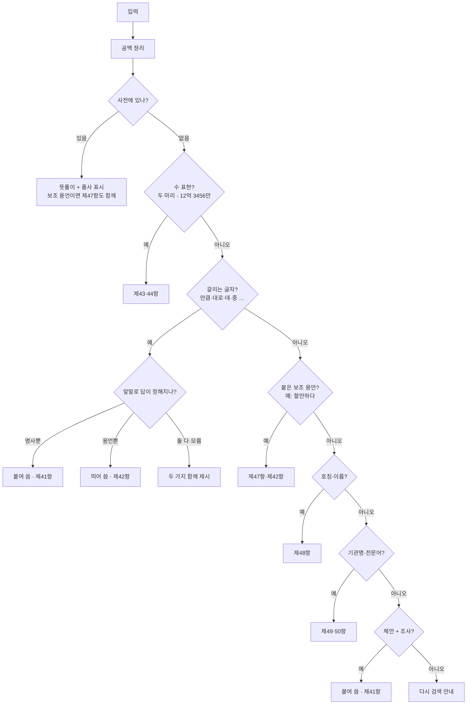

# 한국어 띄어쓰기는 어려워

> 한국인이 가장 많이 묻는 국어 질문 1위, 전문가도 매번 사전을 찾아봐야 하는 것 — 바로 **띄어쓰기**입니다.

붙여 쓴 표현을 입력하면, **우리말샘 사전**과 **한글 맞춤법 규정**을 함께 찾아 *왜 그렇게 띄어/붙여 쓰는지*를 한눈에 보여 주는 도구입니다.

```
입력:  얼마만큼
결과:  얼마만큼  ← 붙여 씁니다
       '얼마'는 명사라서 뒤의 '만큼'은 조사예요. 조사는 앞말에 붙여 써요. (제41항)
```

---

## 바로 써 보기

**[korean-spacing-v0.2.3.zip 다운로드](https://github.com/sophie-linguist/korean-spacing/releases/download/v0.2.3/korean-spacing-v0.2.3.zip)**

1. 위 링크에서 zip 파일을 내려받습니다.
2. 압축을 풀고 **korean-spacing.exe**를 더블클릭합니다.
3. 검색창에 궁금한 표현을 붙여 써서 입력하면 끝!

> Windows 보안 경고가 뜨면 "추가 정보" → "실행"을 누르세요.

---

## 왜 만들었나

국립국어원에 들어오는 국어 상담 중 **띄어쓰기 문의가 35.48%(연 20만 건 이상)로 1위**입니다. 전문가조차 답을 하려면 매번 사전을 찾고, 규정 해설을 읽고, 품사를 따져 봐야 합니다.

> "이 복잡한 확인 과정을, 도구가 먼저 정리해서 보여 줄 수는 없을까?"

이 생각에서 시작했습니다.

---

## 어떻게 판단하나

입력을 받으면 아래 순서로 확인하고, **가장 먼저 들어맞는 답**을 보여 줍니다. 사전에 있는 단어면 곧장 뜻풀이를 보여 주고, 없으면 아래 검사들을 차례로 거칩니다. 어디에도 확신이 없으면 억지로 답하지 않고 다시 검색해 보라고 안내합니다.



---

## 왜 이렇게 만들었나 — 설계 원리

이 도구는 **형태소 분석기(KoNLPy·mecab 등)를 쓰지 않습니다.** 대신 ① 우리말샘 사전, ② 한글 자모 계산, ③ 손으로 고른 형태소 목록(조사·단위·보조 용언 등) 세 가지만으로 판단합니다. 일부러 그렇게 골랐고, 아래에 적은 한계들은 대부분 이 선택의 **그림자(맞바꾼 대가)**입니다.

1. **분석기 대신 사전 + 규칙 — 가볍고, 흔들리지 않고, 설명할 수 있어서.**
   무거운 모델 없이 단일 실행 파일로 배포하려는 것도 있지만, 더 큰 이유는 이 도구가 *교정기*가 아니라 *근거를 보여 주는* 도구라는 점입니다. 통계 모델은 같은 입력에도 답이 흔들리고 "왜 그렇게 봤는지" 설명이 어렵습니다. 자모 규칙 + 사전 조회는 **항상 같은 답**을 주고, 판단의 근거(사전 품사·조항)를 그대로 펼쳐 보일 수 있습니다.

2. **끝에서부터 떼어낸다 — 한국어는 끝에 답이 있어서.**
   띄어쓰기를 가르는 문법 형태소(조사·어미·의존 명사·단위)는 거의 다 어절 **끝**에 붙습니다. 그래서 "끝에서 가장 긴 형태소를 떼고, 남은 앞부분을 검증"하는 단순한 방법으로 대부분이 풀립니다. → 대신 끝 글자 뒤에 형태소가 한 번 **더** 붙으면(`갈데가`) 놓칩니다.

3. **앞부분이 진짜 용언인지 검증한다 — 오분할을 막으려고.**
   `주먹만하다`를 `주먹 만하다`로 쪼개면 안 됩니다. 그래서 떼어낸 앞부분을 자모로 거꾸로 풀어(`할`→`하다`) 사전에서 동사·형용사로 확인될 때만 통과시킵니다. 규칙 활용은 자모 계산으로 깔끔히 되지만, **불규칙은 복원 규칙을 일일이 넣어야** 해서 `도와`(돕다) 같은 형태가 빠집니다.

4. **목록을 일부러 닫아 두었다 — 정확도를 위해.**
   사전에서 "조사이면서 의존 명사인 글자"를 자동으로 다 끌어오면 `게·도·이` 같은 우연한 동음까지 섞여 엉뚱한 곳에서 오작동합니다. 그래서 고빈도만 **골라서** 목록에 담았습니다. 목록 밖(`한테서`, `번째`)은 놓치는 대신 오작동이 적습니다 — 목록은 코드에서 쉽게 넓힐 수 있게 분리해 두었습니다.

5. **확신이 없으면 단정하지 않는다 — 틀린 답이 가장 나쁘니까.**
   앞부분 품사로 답이 정해지면 하나로 좁히고(`예상대로`→붙임, `먹을 만큼`→띄움), 못 가리면 두 해석을 나란히 보여 줍니다(`떠난 지`). 그래서 "뜻으로만 갈리는 어미"는 두 답을 주는 것이 **버그가 아니라 정답**입니다.

> 한마디로, **재현율(많이 잡기)보다 정확도(틀리지 않기)를 택한** 설계입니다. 못 잡는 것은 침묵하거나 양쪽을 보여 주고, 사람의 최종 판단을 돕습니다.

---

## 잘하는 것과 못하는 것

규정 항목별로 도구가 어디까지 도와주는지 정리했습니다.

| 항 | 다루는 내용 | 예시 | 못하는 것 |
|----|------------|------|-----------|
| **제2항** 각 단어는 띄어 씀 | 띄어쓰기 큰 원칙 | 사전 단어 뜻·품사 보여 주기 | 문장을 통째로 넣고 자동으로 띄어 주기 |
| **제41항** 조사는 붙여 씀 | 조사 붙이기 | `학교에서처럼`, `얼마만큼` | 사전에 없는 조사, 어미와 헷갈리는 형태 |
| **제42항** 의존 명사는 띄어 씀 | `만큼·대로·뿐·데·지` 등 | `아는 만큼`(동사 뒤) | 뜻으로만 갈리는 `-ㄴ데/-ㄴ지/-ㄴ바`는 두 답 제시 |
| **제43항** 단위는 띄어 씀 | 수(고유어·한자어) + 단위 | `두 마리`, `열두 마리`, `스무 살`, `오백 원` | 목록에 없는 단위, 사전에 있는 동음어(예: `세대`)는 참고로만 |
| **제44항** 큰 수는 만 단위로 | 만·억·조 단위 띄어쓰기 | `12억 3456만`, `십이억 삼천사백오십육` | 만 단위 표기가 없는 순수 숫자(`1234567`) |
| **제45항** 연결·열거어는 띄어 씀 | `및·겸·대·내지·등` | `한국어 및 한국문화`, `청군 대 백군`, `책상 의자 등` | 연결어 띄어쓰기만 확인(각 단어 내부는 따로) |
| **제47항** 보조 용언 | 본용언 + 보조 용언 | `할 만하다`, `도와 주다` | 불규칙 활용, 목록 밖 보조 용언 |
| **제48항** 이름·호칭 | 성명 + 호칭 | 이름 뒤 직함 | 복잡한 성명, 외국 이름 |
| **제49·50항** 고유명사·전문어 | 기관명·전문 용어 | `인공지능위원회` | 사전에 없는 신조어 일반 |

---

## 한계 (솔직하게)

이 도구는 **자동 교정기가 아닙니다.** 판단의 근거(사전·품사·규정)를 펼쳐 보여 주고, 최종 선택은 사람이 하도록 돕습니다. 확신이 없으면 틀린 답을 내놓기보다 **두 가지를 모두 보여 주거나 침묵**합니다.

- **앞말이 명사도 되고 용언도 되는 경우** — 예: `본대로`의 '본'은 명사 '본'이기도, '보다'의 활용형이기도 해서 한쪽으로 정할 수 없습니다. 두 답을 함께 보여 줍니다.
- **뜻으로만 갈리는 어미** — `-ㄴ데/-ㄴ지/-ㄴ바`는 둘 다 동사 뒤에 붙어, 품사만으로는 구별이 안 됩니다. 두 해석과 구별 기준을 안내합니다.
- **불규칙 활용** — 규칙 활용 위주입니다. ㄹ/ㅂ/ㄷ/ㅅ 불규칙은 일부만, 르/ㅎ 불규칙은 아직입니다.
- **사전에 없는 합성어** — 신조어가 한 단어로 인정되는지는 사전 등재 여부에 따릅니다.
- **여러 어절·문장** — 이 도구는 단어나 짧은 표현 하나에 맞춰져 있습니다. `및·겸·대·내지·등`으로 이어지거나 열거하는 표현(제45항)은 "앞뒤를 띄어 쓴다"고 확인해 주지만, **각 단어 내부의 띄어쓰기까지 분석하지는 않습니다**(예: `한국어 및 한국문화`는 연결어만 봄). 문장 전체 분석은 추후 과제이니, 되도록 단어·짧은 표현 단위로 넣어 주세요.
- **맞는데도 침묵하는 경우** — `삼천이백억`(이미 옳은 붙임)이나 `걸을수록`(어미라 붙임)처럼 틀린 게 없으면 굳이 안내하지 않습니다. 안 되는 것처럼 보일 수 있으나 그대로 쓰면 됩니다.

---

## AI와 함께 만든 이야기

이 도구는 국어학(언어학) 전공자가 방향을 잡고, AI 코딩 도구(**Claude Code**)와 짝을 이뤄 만들었습니다. "전문가가 띄어쓰기를 확인할 때 거치는 과정을 그대로 도구로 옮긴다"는 목표 아래, 사람과 AI의 역할은 이렇게 나뉘었습니다.

- **언어학 판단은 사람이** — 어떤 조항을 어떻게 적용할지, 같은 글자를 무엇으로 구별할지 같은 규정 해석의 최종 책임은 사람에게 있습니다. 우리말샘 사전과 한글 맞춤법 해설을 근거로 삼았습니다.
- **규칙 설계는 함께** — "체언 뒤면 조사, 용언 뒤면 의존 명사"처럼 말로 된 규칙을 코드로 옮기는 과정에서 AI와 의논하며 경계 조건을 다듬었습니다. 예컨대 `얼마만큼`을 두고 "앞말이 명사면 답이 하나로 정해지지 않나?"라는 물음에서 출발해, **앞말의 품사로 답을 좁히는 로직**이 나왔습니다.
- **구현·테스트·문서는 AI가 많이** — 한글 자모 계산, 사전 조회, 검출기 코드, 테스트 케이스, 그리고 이 README까지 AI가 초안을 만들고 사람이 검수·수정하는 방식으로 진행했습니다.

다만 AI는 코드와 초안을 빠르게 만들어 주지만, **무엇이 국어학적으로 맞는지는 스스로 판단하지 못합니다.** 그래서 모든 규칙과 예시는 사람이 사전·규정과 대조해 확인했고, 확신이 서지 않는 부분은 도구가 단정하지 않고 두 해석을 함께 보여 주도록 설계했습니다. 이 **"확신이 없으면 단정하지 않는다"**는 원칙이야말로, AI와 협업하며 얻은 가장 중요한 교훈입니다.

---

## 만든 방식 (개발자용)

| 구성 | 내용 |
|------|------|
| **자료** | 우리말샘 사전(JSON) → SQLite(`dict.db`)로 색인 |
| **핵심 논리** | 한글 자모 계산으로 활용형을 확인하고, 사전으로 단어 경계를 찾음 (무거운 형태소 분석기 없이 동작) |
| **규정** | 한글 맞춤법 제2항 + 제5장(제41~50항) 해설 내장 |
| **화면** | pywebview 웹 UI(기본) / Tkinter(레거시) |
| **배포** | PyInstaller 단일 exe + `dict.db` 동봉 |

### 설치

```bash
pip install -r requirements.txt
```

### 환경변수

`.env.example`을 복사해 `.env`를 만든 뒤 값을 설정합니다.

| 변수 | 필수 | 설명 |
|------|------|------|
| `KOREAN_SPACING_DB_PATH` | 선택 | `dict.db` 경로. 미설정 시 현재 폴더 또는 exe 옆 `dict.db` 사용 |

### 실행

```bash
# 웹 UI (기본)
python -m shell.webui.app

# Tkinter UI (레거시)
python -m shell.gui.app
```

### 사전 인덱스 빌드

```bash
python build/build_index.py \
  --source "전체 내려받기_우리말샘_json_20260603" \
  --output "dict.db" \
  --schema "build/schema.sql"
```

### exe 빌드

```powershell
powershell -ExecutionPolicy Bypass -File .\build\build_exe.ps1 -DictDbPath "dict.db"
```
